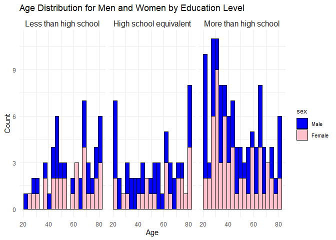
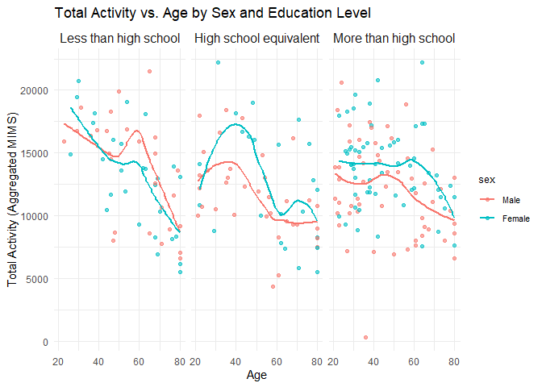
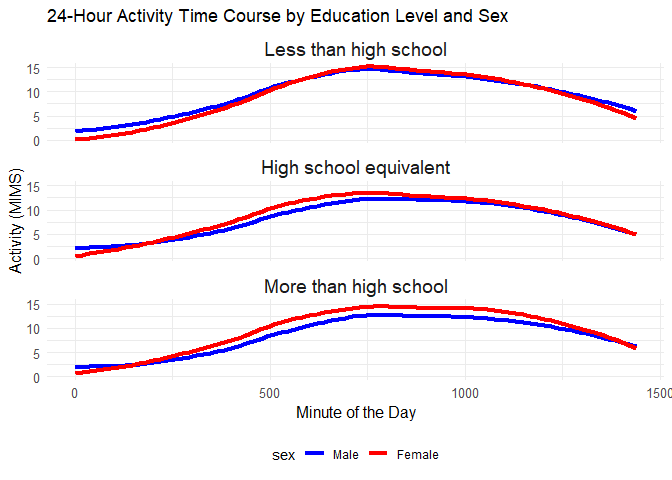
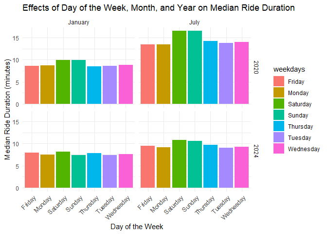
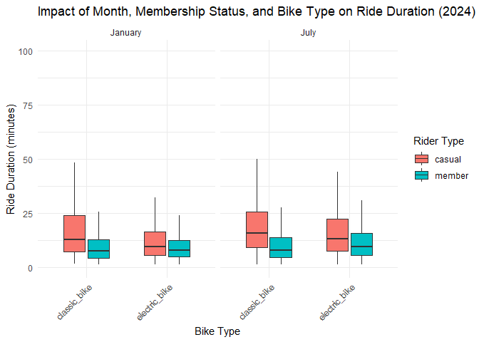

p8105_hw3_tt3022
================
2024-10-15

# Problem 2

load libraries

``` r
library(tidyverse)
```

    ## ── Attaching core tidyverse packages ──────────────────────── tidyverse 2.0.0 ──
    ## ✔ dplyr     1.1.4     ✔ readr     2.1.5
    ## ✔ forcats   1.0.0     ✔ stringr   1.5.1
    ## ✔ ggplot2   3.5.1     ✔ tibble    3.2.1
    ## ✔ lubridate 1.9.3     ✔ tidyr     1.3.1
    ## ✔ purrr     1.0.2     
    ## ── Conflicts ────────────────────────────────────────── tidyverse_conflicts() ──
    ## ✖ dplyr::filter() masks stats::filter()
    ## ✖ dplyr::lag()    masks stats::lag()
    ## ℹ Use the conflicted package (<http://conflicted.r-lib.org/>) to force all conflicts to become errors

``` r
library(dplyr)
library(ggplot2)
```

Load the datasets

``` r
covar <- read_csv("D:/P8105/p8105_hw3_tt3022/Data/nhanes_covar.csv", skip = 4) 
```

    ## Rows: 250 Columns: 5
    ## ── Column specification ────────────────────────────────────────────────────────
    ## Delimiter: ","
    ## dbl (5): SEQN, sex, age, BMI, education
    ## 
    ## ℹ Use `spec()` to retrieve the full column specification for this data.
    ## ℹ Specify the column types or set `show_col_types = FALSE` to quiet this message.

``` r
accel <- read_csv("D:/P8105/p8105_hw3_tt3022/Data/nhanes_accel.csv")
```

    ## Rows: 250 Columns: 1441
    ## ── Column specification ────────────────────────────────────────────────────────
    ## Delimiter: ","
    ## dbl (1441): SEQN, min1, min2, min3, min4, min5, min6, min7, min8, min9, min1...
    ## 
    ## ℹ Use `spec()` to retrieve the full column specification for this data.
    ## ℹ Specify the column types or set `show_col_types = FALSE` to quiet this message.

Clean and filter

``` r
# Merge the datasets using full_join to ensure all participants are included
merged_df <- full_join(covar, accel, by = "SEQN")
filtered_df <- merged_df %>%
  filter(!is.na(age) & age >= 21 & !is.na(sex) & !is.na(BMI) & !is.na(education))
filtered_df <- filtered_df %>%
  mutate(
    sex = factor(sex, levels = c(1, 2), labels = c("Male", "Female")),
    education = factor(education, levels = c(1, 2, 3), labels = c("Less than high school", "High school equivalent", "More than high school"))
  )
```

Create table

``` r
gender_education_table <- filtered_df %>%
  group_by(education, sex) %>%
  summarise(count = n()) %>%
  pivot_wider(names_from = sex, values_from = count, values_fill = 0)
```

    ## `summarise()` has grouped output by 'education'. You can override using the
    ## `.groups` argument.

``` r
ggplot(filtered_df, aes(x = age, fill = sex)) +
  geom_histogram(position = "stack", bins = 20, color = "black") +
  facet_wrap(~education) +
  labs(title = "Age Distribution for Men and Women by Education Level", 
       x = "Age", 
       y = "Count") +
  scale_fill_manual(values = c("Male" = "blue", "Female" = "pink")) + 
  theme_minimal() +
  theme(legend.title = element_text(size = 10),
        legend.text = element_text(size = 8),
        strip.text = element_text(size = 12))
```

<!-- -->

``` r
ggsave("D:/P8105/p8105_hw3_tt3022/picture/age_distribution_by_education.png", width = 8, height = 6)
```

The age distribution for participants with less than a high school
education appears to be spread out across age groups. For participants
with a high school equivalent education,there are some gaps where
certain age ranges have fewer participants. For participants with more
than High School Education,there is a slight imbalance, with more
females than males in younger age groups.

``` r
filtered_df <- filtered_df %>%
  mutate(total_activity = rowSums(select(., starts_with("min")), na.rm = TRUE))
ggplot(filtered_df, aes(x = age, y = total_activity, color = sex)) +
  geom_point(alpha = 0.6) +  
  geom_smooth(method = "loess", se = FALSE) +  
  facet_wrap(~education) +  
  labs(title = "Total Activity vs. Age by Sex and Education Level", 
       x = "Age", 
       y = "Total Activity (Aggregated MIMS)") +
  theme_minimal() +
  theme(legend.title = element_text(size = 10),
        legend.text = element_text(size = 8),
        strip.text = element_text(size = 12))
```

    ## `geom_smooth()` using formula = 'y ~ x'

<!-- -->

``` r
ggsave("D:/P8105/p8105_hw3_tt3022/picture/total_activity_vs_age.png", 
       width = 8, height = 6)
```

    ## `geom_smooth()` using formula = 'y ~ x'

In general, there is a clear decline in total activity with increasing
age across all education levels, though the trend varies slightly
between men and women. Notably, women tend to maintain higher activity
levels compared to men in the “More than high school” category,
particularly in the older age groups.

It spend too much time to run it, I downsampled it.

``` r
long_df <- filtered_df %>%
  pivot_longer(cols = starts_with("min"), 
               names_to = "minute", 
               names_prefix = "min", 
               values_to = "activity") %>%
  mutate(minute = as.numeric(minute))  
long_df_downsampled <- long_df %>%
  mutate(minute_group = floor(minute / 5) * 5) %>%  # Group minutes into 5-minute intervals
  group_by(SEQN, sex, education, minute_group) %>%
  summarise(activity = mean(activity, na.rm = TRUE)) %>%
  ungroup() %>%
  rename(minute = minute_group)
```

    ## `summarise()` has grouped output by 'SEQN', 'sex', 'education'. You can
    ## override using the `.groups` argument.

``` r
ggplot(long_df, aes(x = minute, y = activity, color = sex)) +
  geom_smooth(method = "loess", se = FALSE, size = 1.5) +  
  facet_wrap(~education, ncol = 1) +  
  labs(title = "24-Hour Activity Time Course by Education Level and Sex", 
       x = "Minute of the Day", 
       y = "Activity (MIMS)") +
  scale_color_manual(values = c("Male" = "blue", "Female" = "red")) +
  theme_minimal() +
  theme(legend.position = "bottom", 
        strip.text = element_text(size = 14),
        axis.title = element_text(size = 12),
        axis.text = element_text(size = 10))
```

    ## Warning: Using `size` aesthetic for lines was deprecated in ggplot2 3.4.0.
    ## ℹ Please use `linewidth` instead.
    ## This warning is displayed once every 8 hours.
    ## Call `lifecycle::last_lifecycle_warnings()` to see where this warning was
    ## generated.

    ## `geom_smooth()` using formula = 'y ~ x'

<!-- -->

``` r
ggsave("D:/P8105/p8105_hw3_tt3022/picture/activity_time_courses_5min_intervals.png", 
       width = 8, height = 8)
```

    ## `geom_smooth()` using formula = 'y ~ x'

The 24-hour activity time course shows a consistent pattern across
education levels, with activity increasing in the morning, peaking
around midday, and declining in the evening.

\#Problem 3 read datasets

``` r
jan_2020 <- read_csv("D:/P8105/p8105_hw3_tt3022/Data/Jan 2020 Citi.csv")
```

    ## Rows: 12420 Columns: 7
    ## ── Column specification ────────────────────────────────────────────────────────
    ## Delimiter: ","
    ## chr (6): ride_id, rideable_type, weekdays, start_station_name, end_station_n...
    ## dbl (1): duration
    ## 
    ## ℹ Use `spec()` to retrieve the full column specification for this data.
    ## ℹ Specify the column types or set `show_col_types = FALSE` to quiet this message.

``` r
jul_2020 <- read_csv("D:/P8105/p8105_hw3_tt3022/Data/July 2020 Citi.csv")
```

    ## Rows: 21048 Columns: 7
    ## ── Column specification ────────────────────────────────────────────────────────
    ## Delimiter: ","
    ## chr (6): ride_id, rideable_type, weekdays, start_station_name, end_station_n...
    ## dbl (1): duration
    ## 
    ## ℹ Use `spec()` to retrieve the full column specification for this data.
    ## ℹ Specify the column types or set `show_col_types = FALSE` to quiet this message.

``` r
jan_2024 <- read_csv("D:/P8105/p8105_hw3_tt3022/Data/Jan 2024 Citi.csv")
```

    ## Rows: 18861 Columns: 7
    ## ── Column specification ────────────────────────────────────────────────────────
    ## Delimiter: ","
    ## chr (6): ride_id, rideable_type, weekdays, start_station_name, end_station_n...
    ## dbl (1): duration
    ## 
    ## ℹ Use `spec()` to retrieve the full column specification for this data.
    ## ℹ Specify the column types or set `show_col_types = FALSE` to quiet this message.

``` r
jul_2024 <- read_csv("D:/P8105/p8105_hw3_tt3022/Data/July 2024 Citi.csv")
```

    ## Rows: 47156 Columns: 7
    ## ── Column specification ────────────────────────────────────────────────────────
    ## Delimiter: ","
    ## chr (6): ride_id, rideable_type, weekdays, start_station_name, end_station_n...
    ## dbl (1): duration
    ## 
    ## ℹ Use `spec()` to retrieve the full column specification for this data.
    ## ℹ Specify the column types or set `show_col_types = FALSE` to quiet this message.

since they have the same variables, we can combine by row

``` r
jan_2020 <- jan_2020 %>% mutate(year = 2020, month = "January")
jul_2020 <- jul_2020 %>% mutate(year = 2020, month = "July")
jan_2024 <- jan_2024 %>% mutate(year = 2024, month = "January")
jul_2024 <- jul_2024 %>% mutate(year = 2024, month = "July")

combined_df <- bind_rows(jan_2020, jul_2020, jan_2024, jul_2024)
```

create the table

``` r
summary_table <- combined_df %>%
  group_by(year, month, member_casual) %>%
  summarise(total_rides = n()) %>%
  ungroup()
```

    ## `summarise()` has grouped output by 'year', 'month'. You can override using the
    ## `.groups` argument.

Citi Bike members consistently take more rides than casual riders,
regardless of the month and the number of rides increased significantly
in July 2024 compared to July 2020.

``` r
popular_stations <- jul_2024 %>%
  group_by(start_station_name) %>%
  summarise(total_rides = n()) %>%
  arrange(desc(total_rides)) %>%
  slice_max(total_rides, n = 5)  
```

``` r
median_duration_df <- combined_df %>%
  group_by(year, month, weekdays) %>%
  summarise(median_duration = median(duration, na.rm = TRUE)) %>%
  ungroup()
```

    ## `summarise()` has grouped output by 'year', 'month'. You can override using the
    ## `.groups` argument.

``` r
ggplot(median_duration_df, aes(x = weekdays, y = median_duration, fill = weekdays)) +
  geom_bar(stat = "identity", position = "dodge") +  
  facet_grid(year ~ month) +  
  labs(title = "Effects of Day of the Week, Month, and Year on Median Ride Duration",
       x = "Day of the Week",
       y = "Median Ride Duration (minutes)") +
  theme_minimal() +
  theme(axis.text.x = element_text(angle = 45, hjust = 1))
```

<!-- -->

``` r
ggsave("D:/P8105/p8105_hw3_tt3022/picture/median_ride_duration_plot.png", 
       width = 10, height = 6)
```

It shows that Saturdays and Sundays consistently show higher median ride
durations compared to weekdays and July has generally higher median ride
durations across most days of the week compared to January in both 2020
and 2024.

``` r
data_2024 <- combined_df %>%
  filter(year == 2024)
ggplot(data_2024, aes(x = rideable_type, y = duration, fill = member_casual)) +
  geom_boxplot(outlier.shape = NA, width = 0.6) +  
  coord_cartesian(ylim = c(0, 100)) +  
  facet_wrap(~ month) +  
  labs(title = "Impact of Month, Membership Status, and Bike Type on Ride Duration (2024)",
       x = "Bike Type",
       y = "Ride Duration (minutes)",
       fill = "Rider Type") +
  theme_minimal() +
  theme(axis.text.x = element_text(angle = 45, hjust = 1))
```

<!-- -->

``` r
ggsave("D:/P8105/p8105_hw3_tt3022/picture/ride_duration_by_bike_type_and_membership_2024.png", 
       width = 10, height = 6)
```

Electric bikes generally have shorter ride durations compared to classic
bikes. Casual riders have longer ride durations compared to members for
both bike types. July shows slightly longer ride durations.
